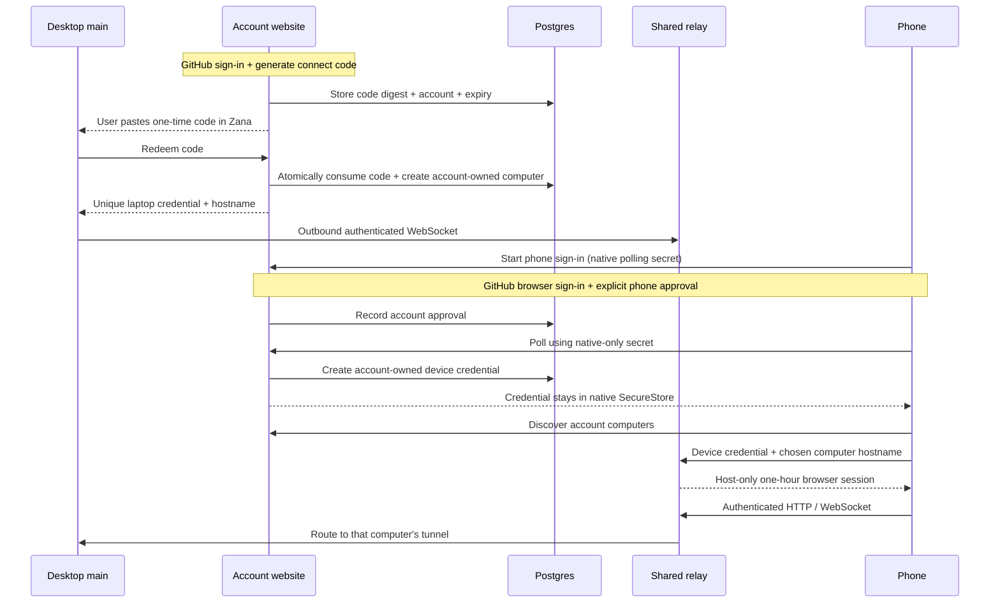

# Zana Connect accounts and laptop routing

Zana Connect implements BB's account-owned computer/device enrollment, browser-approved
phone sign-in, account discovery, per-computer browser sessions, and outbound
tunnels in the existing website Docker app. The reference is BB Connect at
`fdd3de3b19b97e6cd1ef7300cbb54711431249d3`; attribution and its MIT license are
in `website/connect/NOTICE.md` and `BB-LICENSE`.

## Phone sign-in

Open Zana Mobile → **Continue with GitHub**, sign into the same account used
by desktop Remote access, approve the phone, and return to choose a computer.
The list displays its permanent `xxx.zana-ide.com` address. The mobile shell
uses its generated gateway identity for authenticated sessions. This works over
cellular or any internet connection without local-network permission.

`POST /api/connect/phone/start` issues an independent browser approval code and
native-only polling secret for ten minutes. GitHub returns only to the allowed
`/connect/?phone=<code>` page. A signed-in, same-origin browser explicitly approves
or declines; `POST /api/connect/phone/poll` delivers a device credential only to
the holder of the secret. Delivery is idempotent, account-capacity bounded and
serialized with revocation. Secrets are hashed in the existing tables and never
included in browser URLs. Native SecureStore retains pending requests and account
access independently of saved computers. Declined, expired and revoked requests
cannot authorize a session. Local Wi-Fi, manual server URLs and native QR pairing have been removed.

## User flow

1. On the primary computer for an instance, click the **phone icon beside the bug icon** in the bottom
   sidebar, or open **Settings → Remote access**. Click **Get a connect code**.
   A different Connect service can be selected under Advanced connection settings.
2. Sign in with GitHub on the account page and generate a one-time code. Paste
   the code into Zana; it connects automatically. Codes expire after ten minutes,
   can be used once, and generating a new code invalidates the previous one.
   The computer credential stays in main and is written to
   `mobile/connection.json` with mode `0600` using atomic secret storage.
3. Successful pairing enables remote access. Use the header switch to turn access
   off or on. For browser access, choose an address as described below. For a
   phone, open Zana Mobile, choose **Continue with GitHub**, approve the phone
   with the same account and return to choose your computer.
4. On the phone, **This device → Computers on this account** lists online/offline
   computers. Selecting one creates a session for that computer using the same
   account device credential. Discovery still works if the originally paired
   computer is offline or revoked.
5. Revoke a phone or computer at `/connect/`. Phone revocation is also available
   in desktop Phone settings. Disconnecting a computer revokes its tunnel
   credential. The Remote access panel stops the shared gateway before forgetting
   the account and leaves an unconfigured, offline state. It never starts a LAN listener.

To reuse the same projects and history on another computer, join it under
**Settings → Machines** on the primary, or select the existing shared instance
from a secondary desktop. Pairing another independent instance gives it separate
records. Execution machines belong inside the selected instance; the phone's
account list represents instances, not a merged database. See
[multiple machines](./multiple-devices.md) for checkout sources and current
qualification limits.

## Personal browser addresses

After connecting a computer, click **Choose your address** in Remote access
to visit `https://zana-ide.com/connect/` and use
**Pick your address** to claim `your-name.zana-ide.com`. With multiple
computers, choose which one the address opens. Names use 3–30 lowercase letters,
numbers and single dashes, starting and ending with a letter or number. Reserved
service names and the internal `s-` namespace are unavailable. A computer gets
one permanent address; names remain reserved after removal so old bookmarks
cannot silently open someone else's computer.

Open the address in any browser, sign in with the same GitHub account and click
**Open Zana**. The desktop Remote access panel displays the claimed URL with
**Open Zana** and **Copy address** controls. It refreshes the address when you
return from the browser and shows whether the tunnel is connected. Keep Zana
running on the computer with remote access enabled; it shares the existing
Phone access switch. Turning it off stops browser and phone connections while
preserving the account link and address. An authorized visitor sees an offline page when
the computer is disconnected. Browser access uses the existing responsive app
and product HTTP/WebSocket APIs; native desktop-only features still require the
desktop app.

The human-readable address is an alias stored in `connect_addresses`. The
generated tunnel and phone discovery URL stays unchanged, preserving paired
phones and running tunnels. Claims are authorized by account ownership and
serialized in SQL, with a unique global label and at most 500 permanent
reservations per account. The alias itself needs no computer configuration;
use a desktop build containing the response-backpressure fix in
`services/mobile-relay/client.mjs` for reliable concurrent app-asset loading.
Configure `CONNECT_BROWSER_DOMAIN=zana-ide.com`
on the website to select the shorter browser namespace; keep
`CONNECT_DOMAIN=connect.zana-ide.com` for existing computer/phone connections.
If the browser-domain setting is omitted, addresses continue to use
`CONNECT_DOMAIN`. Browser callbacks and sessions use only the selected canonical
hostname. Reserved names such as `www`, `api`, `docs` and `connect` cannot be
claimed, and the root website and reserved service hosts are not routed into
computer tunnels.

Browser sign-in uses a ten-minute, one-use handoff bound to a random HttpOnly
state cookie on the requested computer hostname. The account website approves
the handoff only for that computer's owner. Redemption creates a separate,
host-only HttpOnly browser cookie, limited to one hour and to the originating
website session's expiry. The account cookie is never shared with computer
subdomains. Signing out on the account website or revoking the computer denies
subsequent requests and closes existing streams during the relay's five-second
authorization check. Browser mutations retain exact-origin checks; only GET
document navigations may arrive from another site. Internal product routes stay
blocked at the local gateway.

The additive, idempotent startup schema creates `connect_addresses`,
`connect_browser_requests`, and `connect_browser_sessions`. Address claims use
`GET/POST /api/connect/address`; browser approvals use
`/api/connect/browser/info` and `/api/connect/browser/approve`. The computer
origin owns `/_connect/login` and `/_connect/callback`.

The desktop `mobile:browserAddress` IPC reads `/api/connect/servers` using the
main-owned enrollment credential, selects only the enrolled server ID and
matching transport URL, validates its HTTPS browser origin, and returns only
that address. It rejects stale responses if the local connection changes. The
renderer never receives the credential or other computers' records. Remote
access controls are desktop-only; browser/mobile visitors see instructions for
managing the connection on the host computer.

Local network and direct connections are retired. Old desktop configurations fail
closed and old native profiles remain readable but cannot connect. Sign in with
GitHub to reconnect. The older one-computer HTTPS relay remains an internal
compatibility transport; it is not offered in the current phone onboarding UI.

## Routing and authorization

- Every laptop gets a generated `s-<24 hex characters>.<CONNECT_DOMAIN>` origin.
  Host-only cookies prevent a session for one laptop from opening another.
- Website sessions use the existing GitHub account and signed cookie. Browser
  mutations require an exact same-origin header. Native callers use individual
  server/device bearer credentials. No shared operator token enrolls users.
- Credentials, session tokens, and account-issued computer codes are stored as
  SHA-256 hashes. Computer codes contain 64 random bits, expire after ten minutes,
  and are consumed atomically under the account lock. Redemption is rate limited
  and validates the account's computer limit inside the same transaction. A lost
  redemption response requires a fresh code; remove any unused computer from the
  account page. The older browser-approval computer enrollment API retains its idempotent
  polling behavior for compatibility.
- Phone credentials belong to one account; laptop sessions also bind the chosen
  server. The phone validates every discovered hostname before sending credentials.
- Credential issuance rechecks active computer/device records inside the same
  account transaction lock used by revocation. A request authenticated before
  revocation cannot later redeem a code into fresh account access.
- The relay checks the authoritative device/server/session records on each HTTP
  request and WebSocket upgrade. Revocation in the relay process closes sockets
  and active HTTP streams immediately; checks every five seconds also enforce
  expiry and DB-side revocation while the database is responsive. DB failures
  reject new access and close visitor sockets and active responses.
- Main creates a random loopback-only capability for the managed tunnel. The
  tunnel client inserts it after stripping caller cookies and authorization.
  It never crosses the Internet. The local gateway retains its product path
  allowlist, so `/internal/*` remains inaccessible.
- New tunnel connections replace only the same laptop's old connection.
  Reconnect has bounded exponential backoff, heartbeats, bounded stream/body
  buffers, and no automatic replay of interrupted operations.
- Per-account active computer and device limits are 500. Expired codes/sessions
  and revoked records older than 90 days are cleaned in bounded batches.

The relay terminates TLS and can read proxied traffic, as in the BB reference.
It is not end-to-end encryption; run the service under a trusted operator.

## Heroku deployment

Connect is opt-in: an empty `CONNECT_DOMAIN` leaves existing deployments alone.
Use the same `website/Dockerfile` and `node relay/front-door.mjs` entry point.

Required runtime configuration:

| Variable | Purpose |
| --- | --- |
| `CONNECT_DOMAIN` | Laptop namespace, e.g. `connect.zana-ide.com`, without scheme or wildcard |
| `CONNECT_BROWSER_DOMAIN` | Optional browser address namespace; use `zana-ide.com` for `your-name.zana-ide.com`. Defaults to `CONNECT_DOMAIN` |
| `PUBLIC_BASE_URL` | Exact HTTPS account website origin, e.g. `https://zana-ide.com` |
| `DATABASE_URL` | Persistent Postgres; production refuses SQLite/ephemeral storage |
| `PGSSLMODE` | TLS mode for Postgres, configured as described below |
| `SESSION_SECRET` | Stable secret signing website account sessions |
| `GITHUB_CLIENT_ID`, `GITHUB_CLIENT_SECRET` | Existing GitHub OAuth application |
| `GITHUB_OAUTH_CALLBACK` | Registered HTTPS `/api/auth/github/callback/` URL |

The front door serializes startup migrations with a Postgres advisory lock.
Connect write transactions take the shared form of that lock before account
locks, so startup DDL cannot deadlock concurrent cleanup/credential issuance. It
applies the website migrations (including 64-bit epoch timestamps), then the
Connect tables and indexes. Back up an existing registry DB before deployment.
Do not change its dialect without migrating any existing users and publisher data.

Postgres TLS must be configured for **both** the account website and Connect.
Both use node-postgres and honor `PGSSLMODE`; an unmodified Heroku `DATABASE_URL`
alone does not enable TLS. Prefer `PGSSLMODE=verify-full` with the database's CA
chain trusted by Node (`NODE_EXTRA_CA_CERTS=/path/to/ca.pem` when needed). This
Alpine Docker image includes a checksum-pinned AWS RDS CA bundle at
`/app/certs/aws-rds-global-bundle.pem` and selects it through
`NODE_EXTRA_CA_CERTS`. For Heroku Essential Postgres, set
`PGSSLMODE=verify-full`; the deployed image supplies the required trust chain.
Refresh the Dockerfile's pinned checksum when updating the AWS bundle.
For Heroku plans that use self-signed certificates, Heroku documents
`PGSSLMODE=no-verify`, which encrypts the connection without verifying the
certificate. Apply that exception only to Postgres, never by disabling Node TLS
verification globally. See [Heroku Postgres TLS and Node.js configuration](https://devcenter.heroku.com/articles/connecting-heroku-postgres).

Configure `*.connect.zana-ide.com` on the Heroku app and point its wildcard CNAME
at Heroku's assigned DNS target. TLS must cover that wildcard. Check ACM support
for the app's runtime/generation or provision the matching certificate; do not
assume the certificate for `zana-ide.com` covers its laptop subdomains. Official
references: [wildcard domains](https://devcenter.heroku.com/articles/custom-domains#add-a-wildcard-domain),
[certificate management](https://devcenter.heroku.com/articles/automated-certificate-management).

For the shorter browser addresses, additionally register `*.zana-ide.com` on the
same app, point its wildcard CNAME to the Heroku-assigned target, and provision
TLS covering `*.zana-ide.com`. The existing `*.connect.zana-ide.com` certificate
does not cover this separate namespace. Preserve both wildcard registrations
and the existing root/explicit service DNS records. Set
`CONNECT_BROWSER_DOMAIN=zana-ide.com` only as part of the prepared website
rollout; changing `CONNECT_DOMAIN` would break already-enrolled computer URLs.

Keep **one always-on web dyno** and Preboot off. This version multiplexes up to
128 active laptop tunnels in that process; 500 is a database enrollment limit,
not an assertion that a Basic dyno can carry 500 active laptops. Traffic and
stream limits, memory, DB capacity and workload determine practical capacity.

BB distributes one tunnel object per laptop through Cloudflare Durable Objects.
This Heroku port keeps those objects in one process. Postgres persists accounts
and authorization, but it does not route live sockets between dynos. **Do not
scale `web` above one** until a shared tunnel routing layer is implemented.
See [Heroku WebSockets](https://devcenter.heroku.com/articles/websockets).

Connect sign-in, computer selection and foreground sessions are implemented.
Background push is not yet available for Connect. The native app no longer
registers legacy gateway push tokens. Distributed routing and moving agent
execution into Heroku are not implemented. There is no LAN fallback.

## Verification

- `pnpm exec vitest run website/connect apps/server/src/mobile services/mobile-relay`
- `pnpm exec vitest run website/app/connect website/lib/connect-return.test.ts`
- `pnpm --dir apps/mobile test` and `pnpm --dir apps/mobile typecheck`
- `pnpm typecheck` and `pnpm --dir website exec tsc --noEmit`
- `pnpm test:e2e -- e2e/phone-connect-account.spec.ts e2e/phone-network-connections.spec.ts`

The Connect Electron test also claims an address and opens the built app in a
real Chromium browser through the authenticated alias. It checks host-only
cookies, API access, blocked internal routes and website sign-out, then completes
the original phone sign-in/revocation checks. The Postgres test exercises claim
and both browser-code and computer-code redemption races across independent database pools.
- `pnpm --dir apps/mobile exec expo export --platform ios`
- `docker build -t zcc-connect-test website`

The opt-in Postgres test requires a dedicated disposable DB in
`ZCC_CONNECT_TEST_DATABASE_URL`. `website/connect/postgres.test.ts` checks
concurrent migrations, website auth, persistence and atomic redemption across
connections. The opt-in Docker test additionally needs
`ZCC_CONNECT_TEST_HTTP_ORIGIN=http://127.0.0.1:<published-port>`; its container
must use that same DB, `CONNECT_DOMAIN=connect.example.com`,
`PUBLIC_BASE_URL=https://example.com`, and
`SESSION_SECRET=local-test-signature-secret`. It checks the actual Next page,
browser approval, two accounts/tunnels, session isolation and revocation.
`ZCC_CONNECT_TEST_REQUIRE_TLS=1` asserts that Postgres sessions use TLS.
`ZCC_CONNECT_TEST_DROP_IDLE=1` additionally disconnects idle database sessions
tagged `PGAPPNAME=zcc-connect-docker-fixture` in that disposable DB, then proves
both the front door and Next recover. Use `PGSSLMODE=verify-full` and a trusted
test CA to verify the certificate as well as encryption. The Docker OAuth
fixture path also verifies sign-out redirects back to the public origin.
Never run these fixture settings against a public deployment or real user DB.

Physical-phone acceptance after deployment: enroll two computers, sign in once,
switch between them, move from Wi-Fi to cellular, restart the relay, and revoke
the phone while connected. Automated local tests do not establish real DNS,
GitHub account configuration or physical cellular reachability.

## Remote access settings and BB comparison

The desktop panel uses a master switch, numbered account-code pairing steps,
connection status, and permanent-address open/copy actions. Its shortcut is next
to Report a bug. The switch is unavailable until account pairing succeeds; this
requires an account connection before enabling remote access. Disconnect
stops the shared gateway and leaves the computer unconfigured.

BB's separate “Tell agents about remote access” toggle contributes instructions
for its `connect expose` port-sharing feature. Zana does not yet have that
capability, so the panel deliberately omits that toggle. This implementation
remotely serves the authenticated Zana app, not arbitrary agent development ports.
