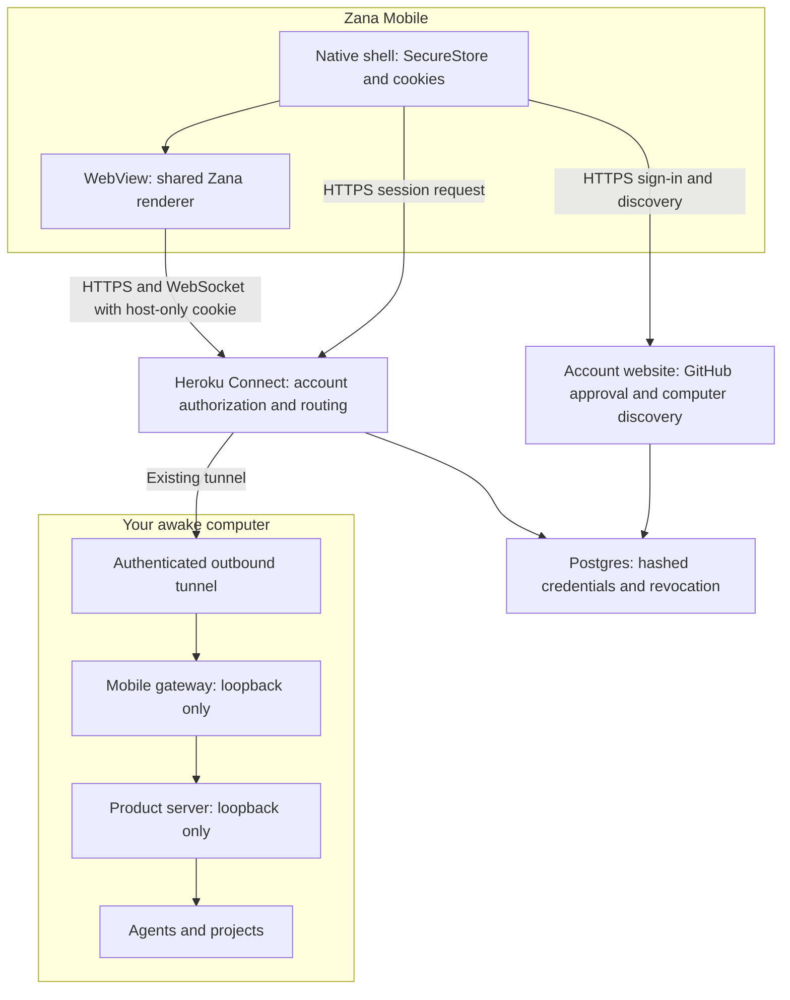

# How Zana Mobile connects to the desktop

The phone signs in with GitHub, receives an account credential and chooses an enrolled computer. HTTPS traffic goes through Zana Connect on Heroku and the computer's outbound tunnel. Agents and files stay on the computer. Shared Wi-Fi, router port forwarding, a VPN and local-network permission are unnecessary.

Canonical guides: [mobile setup](mobile-app.md), [Connect service and authentication](mobile-connect.md).

## Sign in, then open a computer

1. Connect desktop in **Settings → Remote access** using the GitHub account's one-time computer code. Choose the personal `your-name.zana-ide.com` browser address.
2. In Zana Mobile, choose **Continue with GitHub**, approve the phone in the browser and return to the app. The browser has an approval code; only native SecureStore holds the separate polling secret and resulting credential.
3. Select the computer. Its friendly domain appears in the list; the native shell sends credentials only to its validated generated Connect gateway hostname.
4. The service authorizes the selected computer and returns a host-only, HttpOnly session cookie limited to one hour. The WebView uses that cookie to load the shared product renderer, APIs and WebSocket.
5. Reload and foreground renewal obtain a fresh session. Revoking the phone denies new access and closes existing sessions and streams. The desktop continues running.

The relay terminates HTTPS and is trusted with this traffic. This is not end-to-end encryption. The gateway blocks host enrollment, MCP, installer routes and internal product APIs, and does not forward caller authorization, cookies or forwarding headers to the product server.

## Native bridge

`@zana-ai/zcc-mobile-bridge` connects the web page to native share, haptics, badges, device settings, Reload and shell controls. It is not the network transport. Credentials never enter this JavaScript bridge. Background push for Connect accounts is not yet available.

## Retired connections

Local Wi-Fi, direct server URLs and native QR pairing are removed. Old saved desktop modes remain offline with a migration message. Native saved profiles remain readable for identification and removal, but cannot mount a WebView or request a session. Old QR links open GitHub sign-in without redeeming their payload. Disconnecting an account stops the gateway and leaves it unconfigured; no LAN fallback runs.

A test-only loopback gateway and the older one-computer HTTPS relay remain for backend compatibility tests. They do not provide a direct connection option in the native app.
