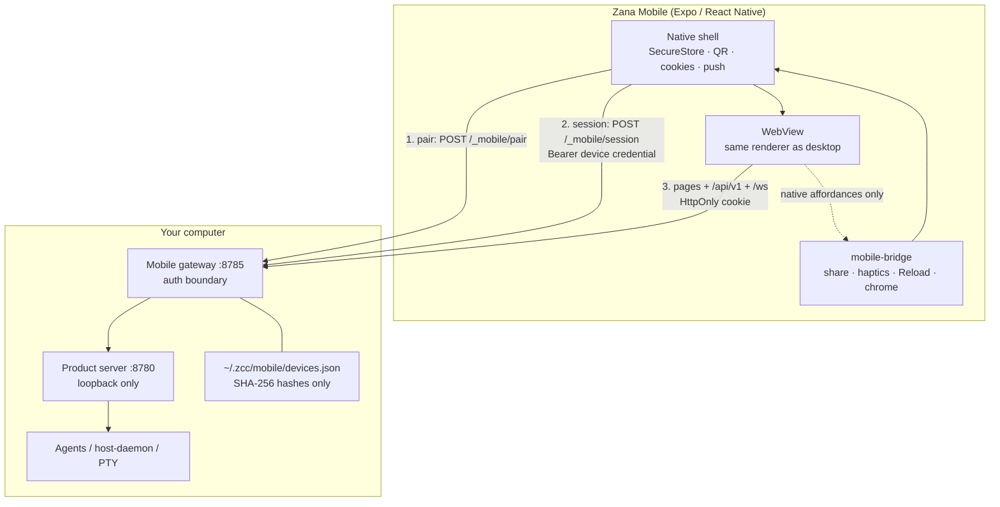
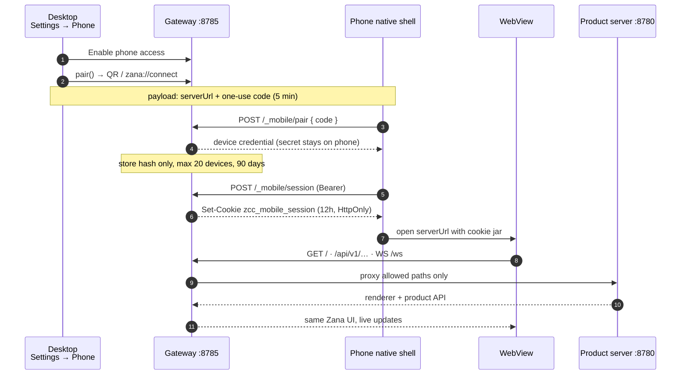
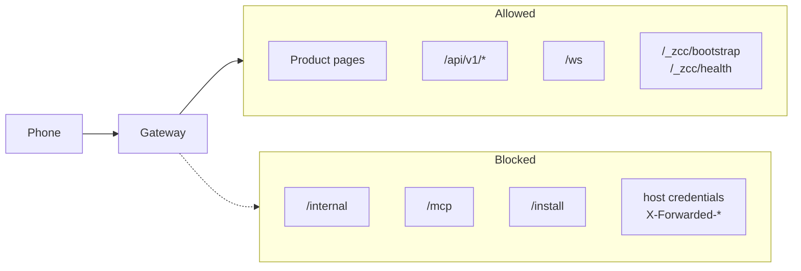

# How Zana Mobile connects to the desktop

**Summary:** The phone does not talk to Electron directly and does not run agents. It talks to a **local mobile gateway** on the computer. That gateway authenticates the device, then proxies the same product UI and APIs the desktop already uses. Work stays on the Mac.

Canonical product doc: `docs/mobile-app.md`. Implementation: `apps/server/src/mobile/gateway.ts`, `apps/server/src/mobile/manager.ts`, `apps/app/src/views/settings/PhoneSettingsView.tsx`, `packages/mobile-bridge`.

## What each side is

| Piece | Role |
| --- | --- |
| **Desktop / product server** | Loopback HTTP (typically `127.0.0.1:8780`). Threads, `/api/v1`, `/ws`, plugins. Agents stay here. |
| **Mobile gateway** | Extra listener on **port 8785**. This is the only thing a phone is allowed to reach. |
| **Zana Mobile** | Expo / React Native **shell**. After pairing, a WebView loads the same renderer as desktop, through that gateway. |

Turn on **Settings → Phone → phone access**. Desktop starts one gateway, prefers a private LAN IP so a real phone on Wi‑Fi can reach it, otherwise loopback (simulator / reverse proxy). `pnpm mobile:serve` is the same gateway for local/dev, forwarding to `:8780`.

The product server itself stays loopback-only. The phone never gets host enrollment, MCP, installer routes, or host credentials.

## Architecture

## Pairing, then every later visit

1. Desktop shows a QR / `zana://connect` payload: `{ version, serverUrl, code, expiresAt }`.
2. Code is **single-use**, **5 minutes**.
3. Phone posts that code to `POST /_mobile/pair`.
4. Gateway mints a **device credential**, stores only its **SHA-256** in `~/.zcc/mobile/devices.json` (max 20 devices, 90-day lifetime). The secret stays on the phone (SecureStore), never in the WebView JS bridge.

Scanning only fills the form; **Connect** is the actual pair.

Then, on every later visit:

1. Native shell sends the device credential: `POST /_mobile/session` → **HttpOnly** cookie `zcc_mobile_session` (12 hours). Reloading / coming to the foreground renews it.
2. WebView loads `serverUrl` with that cookie.
3. Gateway checks origin/`Host`, then **proxies** allowed paths to loopback.

Revoke a device in Phone settings: credential, cookie, and sockets die; desktop keeps working.

## What the gateway forwards vs blocks

The gateway also does **not** forward caller `Authorization`, phone cookies, or `X-Forwarded-*` to the product server.

## Native bridge (not the connection)

`@zana-ai/zcc-mobile-bridge` is a **page ↔ shell** channel: share, haptics, badge, open Settings, Reload, chrome visibility, “auth required”. It is not how you log in. Device secrets never go through that JS bridge.

Push is optional: Expo token registered on the gateway, which watches thread state even if the WebView is asleep. Payloads are generic (status + route), not prompts or code.

## Connect modes

- **Paired (normal):** QR → gateway → cookie → WebView.
- **Direct:** already-private URL or simulator loopback, skipping pairing.

**LAN:** gateway binds a private IPv4 when it can (`192.168.x` / `10.x` / `172.16–31.x`). **Simulator:** loopback, or `pnpm mobile:serve`. **Off-LAN:** HTTPS reverse proxy / Tailscale in front of `127.0.0.1:8785`; the public origin must match exactly and WebSocket upgrades must be preserved. Product server stays loopback.
