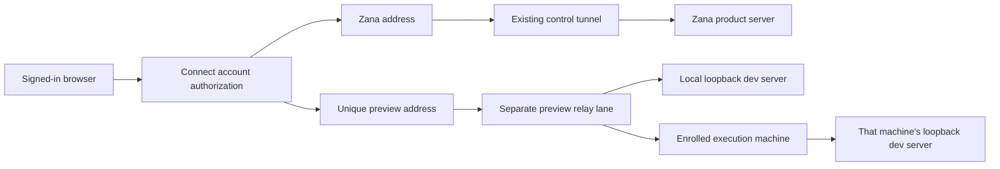

# Private shared previews

Remote access can share a running HTTP development server through the same Connect account as Zana. Open **Settings → Remote access → Shared previews**, select its execution machine, enter the port, and choose **Share preview**. Copy the resulting address to a phone or another computer and sign in with the same account. Desktop **Open preview** uses the in-app browser. The browser's **Share on phone…** link pre-fills the port in Settings; review the machine before sharing.

Start the development server separately, with automatic browser opening disabled. Sharing is explicit; Zana does not scan or publish listening ports.

From an operator shell:

```sh
zcc connect expose 5173
zcc connect expose 3000 --host my-machine
zcc connect shares --json
zcc connect unexpose 5173
```

The Control SDK exposes `zcc.previews.list()`, `share({ port, hostId? })` and `stop({ port, hostId? })`. Modern threads use `share_preview` with `action: "share" | "list" | "stop"` and a port. Main derives that tool's execution machine from the authenticated thread. CLI Agent shells cannot claim operator authority through this API; use Settings or a host shell there.

Shares last eight hours. Sharing the same port again renews the caller's lease. Two threads can retain independent leases; stopping one thread's share leaves the other's lease active. Archiving a thread removes its lease. The operator's **Stop sharing** removes all leases for that machine and port. Expiry and last-lease removal close active HTTP and WebSocket connections. Turning Remote access off disables every preview; stopping individual shares leaves Zana's own remote address available.

An enrolled execution machine opens an outbound preview connection using its existing Connect credential. Legacy SSH Projects must enroll an execution machine first. A stopped server, disconnected machine and incompatible peer have separate statuses. Port numbers must be between 1024 and 65535. Zana's product, MCP, gateway, daemon, callback and debugging listeners are protected, including dynamically assigned ports.

## Transport and trust boundaries



Preview addresses use `name--port.domain` locally and `name--machine-key--port.domain` for an enrolled execution machine. The full prefix is one DNS label. Each preview has an independent browser origin and host-bound Connect session. The gateway binds remote publisher credentials to their account, Zana server and registered execution machine. A machine credential cannot browse previews.

The HTTP/WebSocket relay has its own stream budget so a development app cannot consume Zana's control-tunnel stream slots. Target ports come from a bounded declaration, checked again by the local client on every request. Reserved control paths are unavailable. Header filtering removes Connect credentials and trusted identity headers, confines response cookies, prevents shared-cache storage of preview responses, and only permits local redirects that stay on the preview origin. This is HTTP development-server sharing; arbitrary TCP services and public anonymous links are outside this feature.

The server persists at most 128 caller leases and 32 distinct ports per machine. Writes are atomic and serialized. Remote declarations carry an owner epoch and increasing generation. A daemon requires fresh owner declarations within 15 seconds; disconnect clears its targets. The public gateway also checks the parent Zana tunnel and account/machine revocation.

Preview relay protocol version 1 and host RPC version 40 are required. Deploy the compatible Connect gateway before desktop/daemon rollout. Older gateways fail with an update-required status rather than reusing a control tunnel. Existing control-only clients keep their current behavior.

## Verification

- `pnpm exec vitest run services/mobile-relay apps/server/src/services/previews apps/server/src/http/previews-api.test.ts apps/host-daemon/src/preview-tunnel.test.ts website/connect/gateway.test.ts`
- Settings, CLI, host-tool packing, SDK and browser-action tests cover their respective entry points.
- `pnpm test:e2e -- e2e/phone-connect-account.spec.ts e2e/desktop-browser-broker.spec.ts` exercises the production Electron boundary, HTTPS owner login, assets, WebSocket live reload, protected-port rejection and revocation. The Connect fixture uses localhost subdomains and both loopback address families, since preview networking runs in the server utility process.
- Required live checks: `pnpm live:browser`, `pnpm live:mode-reasoning`, then `pnpm live:memory`. Set `ZCC_SERVER_URL` when both production and development apps are running. Missing prerequisites and provider authentication/network failures are incomplete verification.
