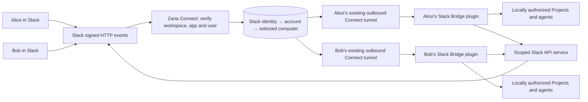

# Slack through Zana Connect

Implementation: 28 September 2026. This is the hosted counterpart of Slack Bridge 0.7.0. It is **not enabled on the public service until deployment and Slack app configuration are completed**.

## Routing

The existing account database, GitHub session, computer enrollment and mobile tunnel are reused. The gateway adds an **in-process-only** `dispatchPlugin` operation, bound to account + computer + fixed plugin endpoint. It does not create a phone session or expose a public arbitrary HTTP proxy. Each request rechecks active computer ownership. Existing phone cookies and routes retain their own authorization.

The cloud owns the Slack bot token and signing secret. A laptop has only a revocable link credential. Signed, time-limited envelopes are accepted by its plugin; a persisted nonce cache rejects replay. The plugin verifies workspace, app and owner again, then uses its existing command parser, Project/channel mappings, local permission gates, receipt ledger and outgoing delivery ledger.

## User journey

1. Connect the computer using **Settings → Phone → Zana Connect**, and enable phone access so the shared tunnel is running. A phone itself is not required.
2. Open **Zana → Home** in Slack. For an unlinked user the server shows **Connect my computer**.
3. Sign in to the existing Connect account. Confirm the displayed Slack user/workspace and explicitly choose an enrolled computer.
4. Copy the ten-minute activation code into **Slack Bridge → Connection settings → Connect through Zana Connect** on that computer. The cloud probes that exact computer before activating the link. A code pasted on another computer cannot complete activation.
5. Choose the available Projects, execution machines, models and Slack channels locally. Only those destinations are available to the linked Slack user.

One active computer is selected per Slack identity. Selecting a replacement revokes the previous link only after the new computer successfully activates. Existing conversation routes are not transferred: start a new conversation after replacing a computer. Another Slack user cannot continue or control a conversation owned by the original user.

## Deploy and enable

Keep the existing Connect requirements from [mobile-connect.md](mobile-connect.md), including persistent Postgres, verified TLS, one web process, and no Heroku Preboot. The active tunnel map is process-local; this implementation does not add multi-dyno routing.

The hosted service activates Slack only when all four server-side variables are configured:

| Variable | Meaning |
| --- | --- |
| `SLACK_APP_ID` | Installed Slack app's `A…` identifier |
| `SLACK_TEAM_ID` | Workspace's `T…` identifier |
| `SLACK_BOT_TOKEN` | Bot token for that installation; secret |
| `SLACK_SIGNING_SECRET` | App's Slack signing secret; secret |

Existing `SESSION_SECRET`, `PUBLIC_BASE_URL`, `CONNECT_DOMAIN` and `DATABASE_URL` remain required. Never put bot tokens, signing secrets or activation codes in Git, screenshots, URLs, shell history or reports. `SESSION_SECRET` rotation invalidates local link credentials and requires relinking.

1. Deploy the website/front door including `website/slack/`. The Docker image explicitly copies it. Schema creation uses the existing migration lock and is additive.
2. Configure the four Slack variables through the hosting secret store. On startup the bot token must resolve to the expected workspace. A Slack configuration/network failure leaves the mobile gateway running and logs a generic error; fix the configuration and restart to retry Slack initialization.
3. Stop the old direct Socket Mode receiver for **this same app**, then disable Socket Mode in Slack. Keep a record of the previous configuration for rollback. Do not have competing desktop receivers.
4. Set Events Request URL, Interactivity Request URL and the `/zana` Request URL to `https://zana-ide.com/api/slack/events/` (or your configured account origin). Slack's signed URL-verification challenge is supported.
5. Subscribe to `app_mention` and `app_home_opened`; enable the Home tab. Bot scopes: `app_mentions:read`, `chat:write`, `channels:read`, `groups:read`, `users:read`, `commands`. Invite the bot to the intended internal channels. Complete any Slack reinstall/consent step separately if scopes changed.
6. Install/reload Slack Bridge 0.7.0 on both test computers, then follow the user journey above independently for two Slack users.

The plugin's `slack-app-connect-manifest.json` is the HTTP variant of its direct-mode manifest. Adjust the hostname for self-hosting. Work Object iframe presentation is not forwarded by the shared transport; use Home and normal status cards. Existing direct mode retains its separate website-preview setup.

## Delivery and failure behavior

| State | Meaning / response |
| --- | --- |
| Cloud received | Verified event is durably recorded before Slack's ACK. This is not proof of agent start. |
| Local received | Plugin ACK follows local receipt persistence for agent requests. Normal queue/agent status cards follow. |
| Delivered | Plugin acknowledged the invocation. It may have rejected the task locally; inspect its status card. |
| Not started | Computer/plugin was unavailable before admission, or a received cloud event aged past ten seconds. No wake-up queue is retained. |
| Needs review | Dispatch was interrupted or its outcome is unknown. Inspect Zana; do not automatically resend. |
| Slack sent | Slack Web API accepted the outgoing message. This does not prove the recipient read it. |

Cloud event IDs and raw interaction hashes deduplicate Slack retries. A dyno restart marks in-flight requests for review; it never silently replays them. Interactive requests have a 1.8-second tunnel deadline and local ACK has 1.4 seconds. Expired triggers cannot be reused. Failed modal submission delivery leaves a visible “Check Zana” modal. Ordinary offline requests receive a private explanation where Slack permits ephemeral messages; Home can show the offline state.

The cloud stores pending event bodies only until delivery/failure; receipt metadata lasts one day (maximum 2,000 requests per link), conversation/message ownership up to 90 days, unused link codes ten minutes. Expired records are pruned. Link history is capped at 200 per account, conversations at 2,000 per link, and scoped objects at 10,000 per link. The 90-day route limit requires a new Slack conversation afterwards. This is a control-message service, not an archival transcript store.

Slack API calls are allowlisted. User lookup and Home publication are restricted to the linked user. Channels must be internal, unshared, bot-joined and in the linked user's membership list. Membership enumeration is bounded to 1,000 channels; unmatched channels fail closed. Views/triggers and bot messages must have been recorded for the same link. Message writes disable automatic parsing, broadcast expansion and link unfurls. Files, arbitrary URLs and arbitrary Slack API methods are unsupported.

## Revoke and roll back

Revoke a Slack link in the Connect account page or choose **Unlink Zana Connect** locally. Local unlink confirms central revocation before deleting its key; a failed network request remains visible and retryable. Disconnecting/revoking the computer also invalidates its Slack routing. These operations do not stop agents already executing locally; stop them explicitly when wanted.

For rollback, remove Slack environment configuration or disable its HTTP subscriptions, revoke the shared link, re-enable Slack Socket Mode and use the retained direct-mode settings. Existing mobile sessions are independent. Old task routes are not migrated automatically.

## Acceptance checks

Run focused Connect/Slack/website tests and plugin tests/typecheck. The `phone-connect-account.spec.ts` Electron test exercises a realistic (>8 KiB) plugin payload through the actual mobile tunnel and local plugin HTTP handler, checks wrong-account rejection, then verifies phone HTTP/WebSocket traffic and revocation still work. Live harness mode/reasoning and Memory suites are required after plugin launch-path edits.

Before announcing hosted availability, test two real Slack identities with two account-owned computers: Home linking, wrong-computer activation rejection, Project selection, mention launch, same-thread follow-up, `/zana` modal launch, stop, independent answers, cross-user denial, offline explanation, reconnect, revoked computer and revoked link. Confirm the separate task/answer delivery records. Native `/zana` still requires Slack's app installation approval where pending.

## Verification recorded on 28 September 2026

- Website/Connect/Slack tests: 50 passed; optional Docker/Postgres tests require their separate environments and were skipped.
- New server integration and UI coverage: 92.34% statements, 83.33% branches, 94% functions, 97.91% lines.
- Plugin: 131 tests and TypeScript passed; 93.52% statements, 90.68% branches, 90.27% functions, 94.87% lines.
- Website TypeScript and production Next build passed.
- Mobile regression unit tests: 32 passed.
- Built Electron: both Connect account and network-connection specs passed. The new plugin probe found the bootstrap-port capture bug; the shared mobile changes now resolve the supervised origin when the gateway starts. The successful test confirms the isolated plugin endpoint, not another running Zana instance.
- Live harness suite: 54 passed; real Memory CLI/retrieval checks: 2 passed. Each suite has one intentionally skipped non-live gating test. A missing-Memory preflight run was discarded; Memory was temporarily supplied and removed after the real check.
- Plugin 0.7.0 installed and running; its Connect setup controls were observed in the desktop UI. Hosted Slack delivery and a two-human Slack trial are still pending rollout.

Detailed logs are under `.zcc/artifacts/slack-connect-implementation/` in the implementation checkout. No production deployment, Slack token transfer, app-scope acceptance or Slack transport switch was performed.
